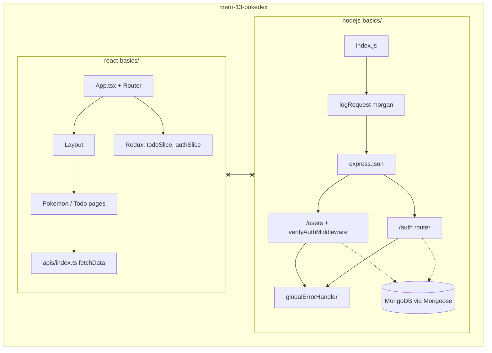
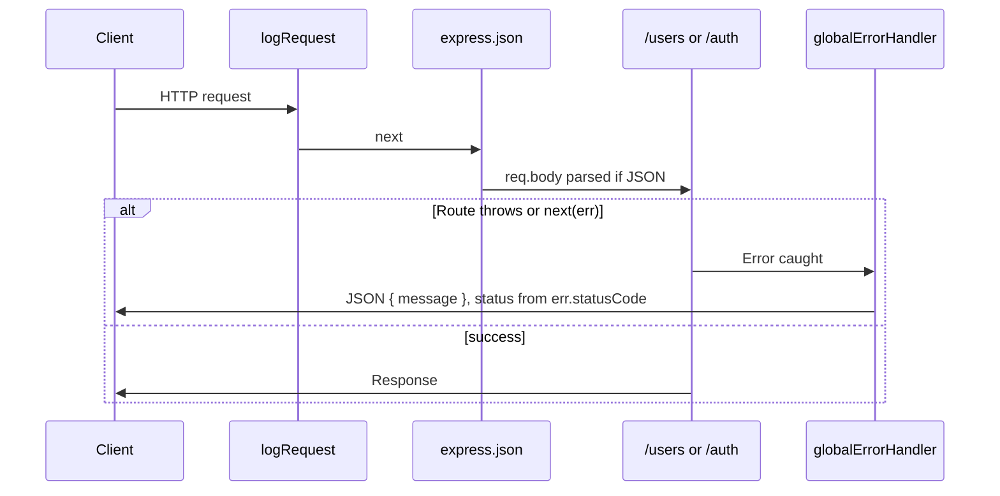
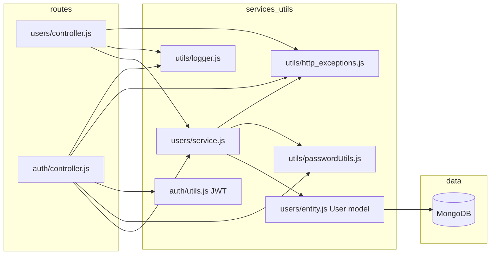

# mern-13-pokedex — architecture

This workspace holds **two separate applications**: an Express API in `nodejs-basics/` and a Vite + React app in `react-basics/`. They are not wired together by default; the frontend uses `fetch` helpers against arbitrary URLs (for example Pokémon APIs), not necessarily `http://localhost:3000`.

## What’s in the repo

| Area | Stack | Role |
|------|--------|------|
| **`nodejs-basics/`** | Express 5 on port **3000**, Mongoose, JWT, dotenv | API: logging, global errors, `/auth` (signup/signin), `/users` (partial CRUD), MongoDB persistence |
| **`react-basics/`** | Vite + React + React Router + Redux Toolkit | UI: Pokémon pages, todo demo; `src/apis/index.ts` is a generic `fetch` helper |

---

## Repository + backend request flow



The dashed link between **frontend** and **backend** means there is no required integration in this repo; the `x--x` connector indicates “no hard dependency.”

---

## Express pipeline



- **`middleware/logRequest.js`**: Morgan `dev` logging.
- **`utils/request_error_handler.js`**: Last middleware; uses `err.statusCode` and `err.message` from typed errors in `utils/http_exceptions.js`.

---

## Protected `/users` routes

`index.js` mounts:

```text
app.use('/users', verifyAuthMiddleware, userRouter);
```

**`middleware/verifyAuth.js`** expects `Authorization: Bearer <jwt>`, verifies the token with `auth/utils.js` (`JWT_SECRET` from the environment), and sets `req.user = { id }` before calling `next()`.

**`/auth`** routes are **not** behind this middleware (clients obtain a token from sign-in first).

---

## Backend modules (dependencies)



- **`users/entity.js`**: Mongoose `User` schema (name, email, password, timestamps).
- **`users/service.js`**: `createUser`, `getUserByIdOrEmail` (by ObjectId or email), validation with Zod-style helpers.
- **`db/index.js`**: `connectToDb()` builds a URI from `MONGO_USERNAME`, `MONGO_PASSWORD`, `MONGO_CLUSTER`, `MONGO_DATABASE` and connects with Mongoose.

---

## Auth flow

1. **Signup** — `POST /auth/signup` with JSON body: validates input, ensures the user does not already exist, then `createUser` persists a bcrypt-hashed password via the service and model.
2. **Signin** — `GET /auth/signin` with **`Authorization` header** as **base64-encoded `email:password`**: loads user, `verifyPassword`, then **`generateAccessToken({ id: user.id })`** (JWT, 1h expiry; secret from `process.env.JWT_SECRET`).

Downstream calls to **`/users/*`** should send **`Authorization: Bearer <accessToken>`**.

---

## Configuration (`nodejs-basics/.env`)

Typical variables (see your local `.env` for exact values):

- **`JWT_SECRET`** — required for signing and verifying JWTs.
- **`MONGO_USERNAME`**, **`MONGO_PASSWORD`**, **`MONGO_CLUSTER`**, **`MONGO_DATABASE`** — used by `db/index.js` to connect to MongoDB Atlas (or compatible URI pattern).

`index.js` loads config with `require('dotenv').config()` before other imports that depend on env vars.

---

## Frontend (`react-basics/`)

- **Routes** (under `Layout`): `/pokemon`, `/pokemon/:id`, `/todo`.
- **Redux**: `todoSlice` and `authSlice` in `src/store/`.
- **`src/apis/index.ts`**: `fetchData(url)` + React Query `QueryClient` export — not tied to the Express base URL unless you point `fetch` there yourself.

---

## Summary

This repo is a **learning-style MERN workspace**: an Express API with **MongoDB**, **JWT auth**, **Bearer middleware** on `/users`, centralized HTTP errors and logging, plus a separate React app for routing, Redux, and external API demos. To connect them end-to-end, point the React `fetch` layer at `http://localhost:3000` (or your deployed API) and store or send the JWT from sign-in on protected requests.
